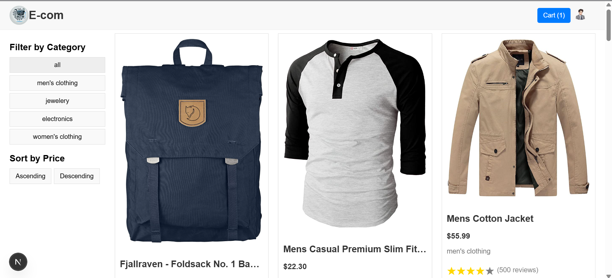
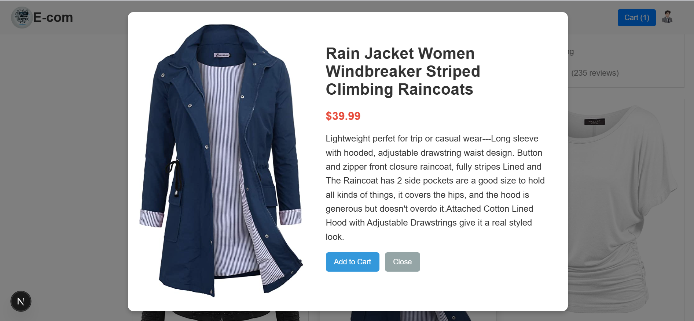
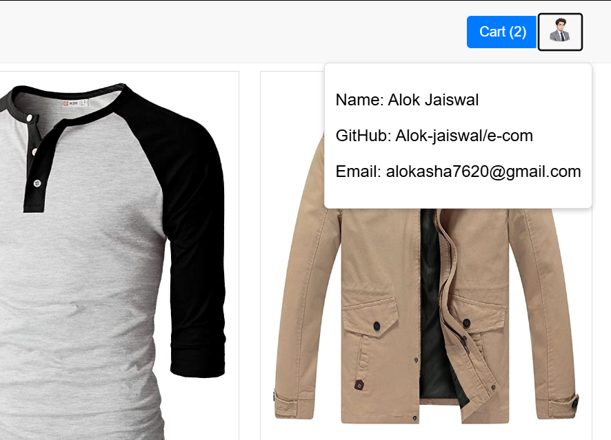
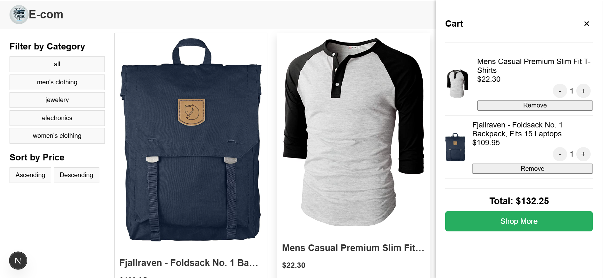

# E-commerce Product Listing Page

This project is a simple e-commerce product listing page built with Next.js, React, Redux Toolkit, and SCSS modules. It displays a list of products fetched from an API, allows users to view product details in a modal, add products to a cart, and view the cart in a drawer.

## Table of Contents

- [Features](#features)
- [Technologies Used](#technologies-used)
- [Installation](#installation)
- [Usage](#usage)
- [Project Structure](#project-structure)
- [API Data](#api-data)
- [Redux Store](#redux-store)
- [Contributing](#contributing)
- [License](#license)
- [Author](#author)

## Features

- **Product Listing:** Displays a list of products with images, titles, prices, categories, and ratings.
- **Product Details Modal:** Allows users to view detailed product information in a modal.
- **Add to Cart:** Enables users to add products to a cart.
- **Cart Drawer:** Displays the cart items in a drawer with quantity and total items.
- **Responsive Design:** Ensures the website is accessible and user-friendly on various devices.
- **Profile Icon:** Shows profile details when clicked.
- **Footer:** Displays project information and a GitHub link.

## Technologies Used

- **Next.js:** React framework for server-side rendering and static site generation.
- **React:** JavaScript library for building user interfaces.
- **Redux Toolkit:** State management library for managing application state.
- **SCSS Modules:** CSS modules with SCSS syntax for component-level styling.
- **React Rating Stars Component:** Star rating component.
- **Next Image:** Optimize images.

## Screenshots






## Installation

1.  **Clone the repository:**

    ```bash
    git clone [https://github.com/Alok-jaiswal/e-com-test.git](https://www.google.com/search?q=https://github.com/Alok-jaiswal/e-com-test.git)
    ```

2.  **Navigate to the project directory:**

    ```bash
    cd e-com
    ```

3.  **Install dependencies:**

    ```bash
    npm install
    # or
    yarn install
    ```

## Usage

1.  **Start the development server:**

    ```bash
    npm run dev
    # or
    yarn dev
    ```

2.  **Open your browser and navigate to `http://localhost:3000` to view the application.**

## Project Structure

```tree
e-com/
├── components/
│   ├── CartDrawer.js
│   ├── Footer.js
│   ├── Header.js
│   ├── Layout.js
│   ├── ProductCard.js
│   ├── ProductDetailsModal.js
│   └── ...
├── pages/
│   ├── _app.js
│   ├── index.js
│   └── ...
├── public/
│   ├── logo.png
│   ├── profile-icon.png
│   ├── product-listing.png
│   ├── product-details-modal.png
│   ├── profile-dropdown.png
│   ├── cart-drawer.png
│   └── ...
├── redux/
│   ├── cartSlice.js
│   └── store.js
├── styles/
│   ├── globals.scss
│   ├── header.module.scss
│   ├── footer.module.scss
│   ├── layout.module.scss
│   ├── productCard.module.scss
│   ├── productDetailsModal.module.scss
│   └── ...
├── .gitignore
├── next.config.js
├── package-lock.json
├── package.json
└── README.md

## API Data

The product data is fetched from the [Fake Store API](https://fakestoreapi.com/products).

## Redux Store

The Redux store manages the cart state. The `cartSlice.js` file defines the actions and reducers for adding and removing items from the cart.

## Contributing

Contributions are welcome! If you find a bug or have an idea for a new feature, please open an issue or submit a pull request.

## License

This project is licensed under the [MIT License](LICENSE).

## Author

- Alok Jaiswal - [https://github.com/Alok-jaiswal](https://github.com/Alok-jaiswal)

